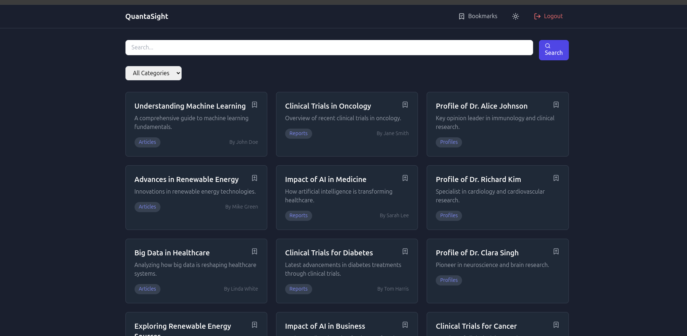
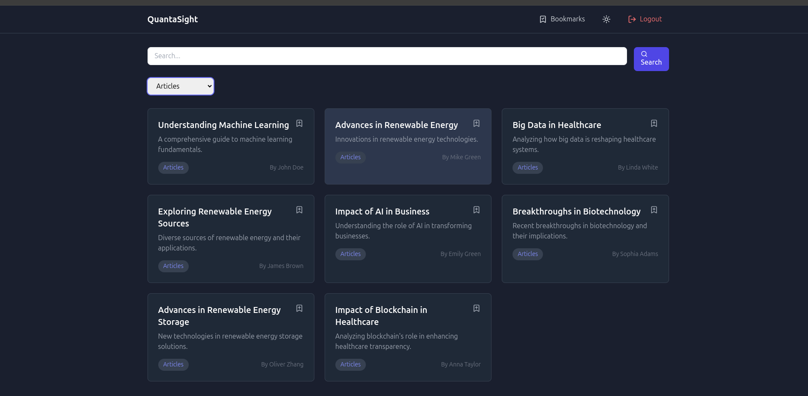
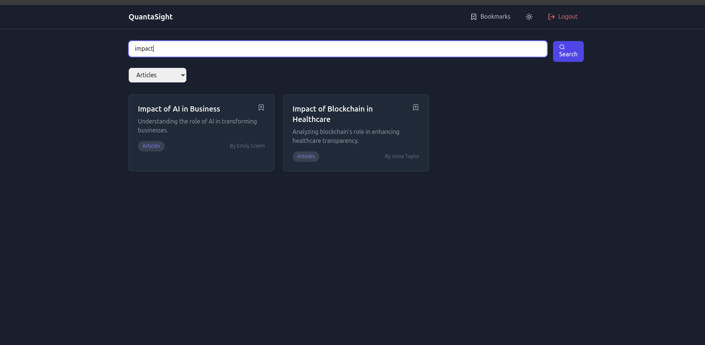
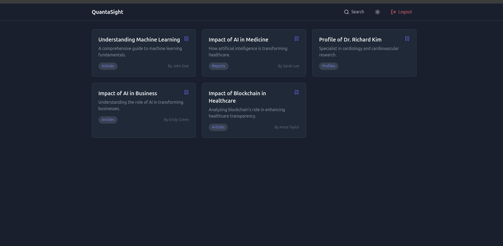
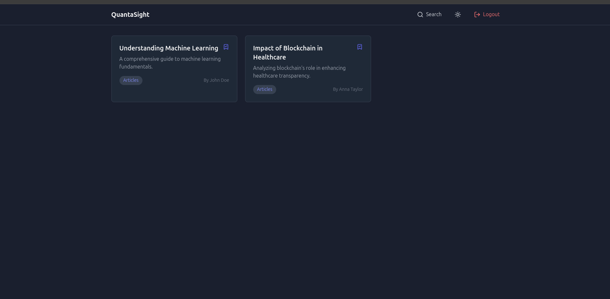
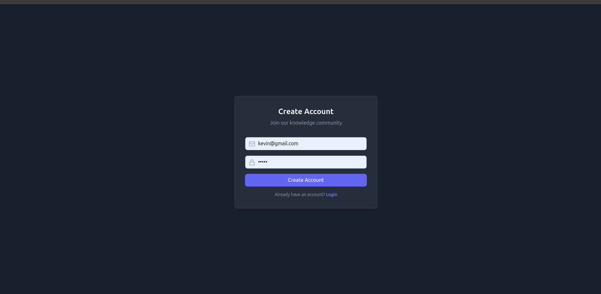

Here’s the entire README content in proper Markdown syntax:

```markdown
# **QuantaSight - Search and Bookmark Web Application**

A full-stack web application that allows users to **search, filter, and bookmark content** across multiple categories. Built with **React**, **Node.js**, **Express**, and **MySQL**, it features **user authentication**, **dynamic search capabilities**, and **bookmark management**.

---

## **Table of Contents**
- [Features](#features)
- [Tech Stack](#tech-stack)
- [Project Structure](#project-structure)
- [Setup and Installation](#setup-and-installation)
  - [Running Without Docker](#running-without-docker)
  - [Running With Docker](#running-with-docker)
- [API Documentation](#api-documentation)
- [Frontend Documentation](#frontend-documentation)
- [Database Schema](#database-schema)
- [Challenges and Solutions](#challenges-and-solutions)

---

## **Features**

- 🔐 **User Authentication** (Login/Register)  
- 🔍 **Content Search** with Category Filtering  
- 🔖 **Bookmark Management**  
- 🌓 **Dark/Light Theme Support**  
- 📱 **Responsive Design**  
- ⚡ **Real-time Search Updates**  
- 🔒 **Secure API Endpoints**  
- 🗄️ **Data Persistence**  

---

## **Tech Stack**

### **Frontend**
- **React 18** with Hooks  
- **Tailwind CSS** for styling  
- **Lucide Icons** for UI elements  
- **Vite** for development and build process  
- **Context API** for state management  

### **Backend**
- **Node.js**  
- **Express.js**  
- **MySQL** for database  
- **JWT** for authentication  
- **bcrypt** for password hashing  
- **CORS** enabled  
- **Environment variable configuration**

### **DevOps**
- **Docker**  
- **Docker Compose**  
- **Volume persistence** for MySQL data  

---

## **Project Structure**

```plaintext
quantasight/
├── frontend/
│   ├── src/
│   │   ├── components/
│   │   │   ├── auth/
│   │   │   ├── layout/
│   │   │   └── search/
│   │   ├── context/
│   │   ├── hooks/
│   │   ├── utils/
│   │   └── App.jsx
│   ├── Dockerfile
│   └── package.json
├── backend/
│   ├── src/
│   │   ├── config/
│   │   ├── db/
│   │   ├── middleware/
│   │   ├── routes/
│   │   ├── services/
│   │   └── main.js
│   ├── Dockerfile
│   └── package.json
├── mysql-data/
├── .gitignore
├── .dockerignore
├── docker-compose.yml
└── README.md
```

---

## **Setup and Installation**

### **Running Without Docker**

#### **Prerequisites**
- **Node.js** (v16 or higher)
- **MySQL** (v8.0)
- **npm** or **yarn**

#### **Backend Setup**
1. Navigate to the backend directory:
   ```bash
   cd backend
   ```
2. Install dependencies:
   ```bash
   npm install
   ```
3. Create an `.env` file:
   ```plaintext
   DB_HOST=localhost
   DB_USER=your_mysql_user
   DB_PASSWORD=your_mysql_password
   DB_NAME=quantasight_search
   JWT_SECRET=your_jwt_secret
   PORT=3001
   ```
4. Create the database and import schema:
   ```sql
   CREATE DATABASE quantasight_search;
   USE quantasight_search;
   -- Import schema.sql
   ```
5. Start the server:
   ```bash
   npm run dev
   ```

#### **Frontend Setup**
1. Navigate to the frontend directory:
   ```bash
   cd frontend
   ```
2. Install dependencies:
   ```bash
   npm install
   ```
3. Start the development server:
   ```bash
   npm run dev
   ```

---

### **Running With Docker**

1. Clone the repository:
   ```bash
   git clone <repository-url>
   cd quantasight
   ```
2. Create an `.env` file in the root directory:
   ```plaintext
   MYSQL_ROOT_PASSWORD=rootpassword
   MYSQL_DATABASE=quantasight_search
   MYSQL_USER=user
   MYSQL_PASSWORD=userpassword
   JWT_SECRET=your_jwt_secret
   ```
3. Start the containers:
   ```bash
   docker-compose up --build
   ```
4. Access the application:
  - Frontend: [http://localhost:5173](http://localhost:5173)
  - Backend: [http://localhost:3001](http://localhost:3001)
  - MySQL: `localhost:3306`

---

## **API Documentation**

### **Authentication Endpoints**

#### **Register User**
- **Endpoint:** `POST /auth/register`
- **Request:**
  ```json
  {
    "email": "user@example.com",
    "password": "password123"
  }
  ```
- **Response:**
  ```json
  {
    "success": true,
    "token": "jwt_token_here",
    "user": {
      "id": 1,
      "email": "user@example.com"
    }
  }
  ```

#### **Login User**
- **Endpoint:** `POST /auth/login`
- **Request:**
  ```json
  {
    "email": "user@example.com",
    "password": "password123"
  }
  ```
- **Response:**
  ```json
  {
    "token": "jwt_token_here",
    "user": {
      "id": 1,
      "email": "user@example.com"
    }
  }
  ```

### **Search Endpoints**

#### **Search Content**
- **Endpoint:** `GET /search`
- **Query Params:**
  - `term` - Search term
  - `category` - Filter by category
- **Authorization:** `Bearer <your_jwt_token>`
- **Response:**
  ```json
  [
    {
      "id": 1,
      "title": "Understanding Machine Learning",
      "description": "A comprehensive guide...",
      "category": "Articles"
    }
  ]
  ```

### **Bookmark Endpoints**

#### **Add/Remove Bookmark**
- **Endpoint:** `POST /bookmarks`
- **Request:**
  ```json
  {
    "resultId": 1
  }
  ```
- **Response:**
  ```json
  {
    "success": true,
    "action": "added"
  }
  ```

#### **Get Bookmarks**
- **Endpoint:** `GET /bookmarks`
- **Authorization:** `Bearer <your_jwt_token>`
- **Response:**
  ```json
  [
    {
      "id": 1,
      "title": "Understanding Machine Learning"
    }
  ]
  ```

---

## **Challenges and Solutions**

| **Challenge**             | **Solution**                                                                 | **Impact**                                      |
|----------------------------|-----------------------------------------------------------------------------|------------------------------------------------|
| **Database Management**    | Used connection pooling and proper connection closure.                     | Improved performance and reduced resource leaks. |
| **JWT Authentication**     | Created middleware for token verification.                                 | Enhanced security and session management.       |
| **Theme Switching**         | Implemented Context API with localStorage.                                | Seamless theme switching with persistence.      |
| **Search Performance**     | Implemented backend caching.                                              | Faster results and reduced database load.       |
| **Docker Persistence**     | Used named volumes for MySQL data.                                         | Reliable data persistence across container restarts. |

---


output 



### filter 



### Search 



### bookmark



### remove bookmark 



### sign up and sign in 

